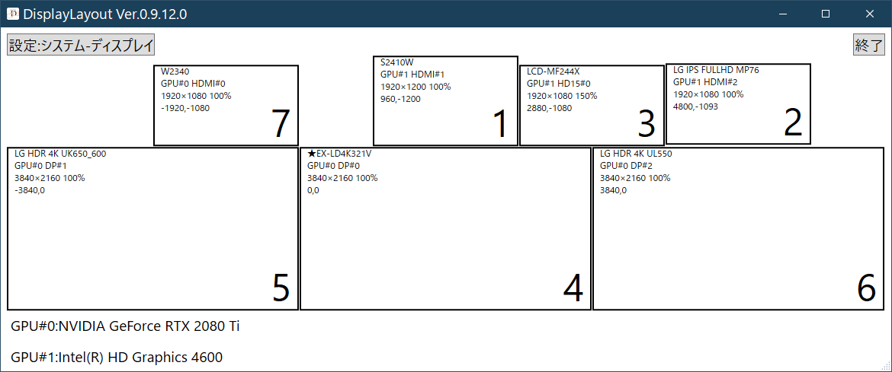
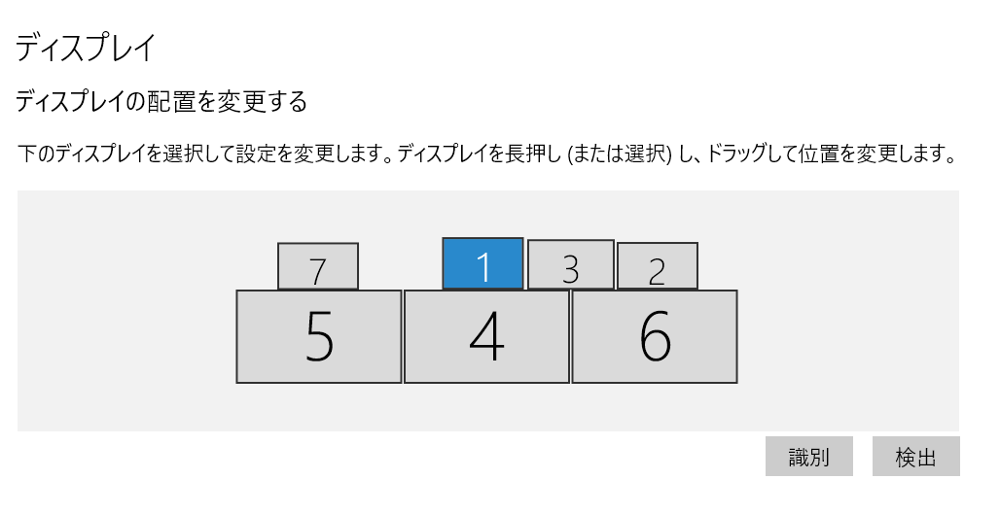
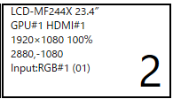
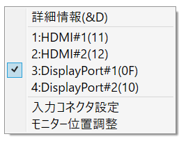
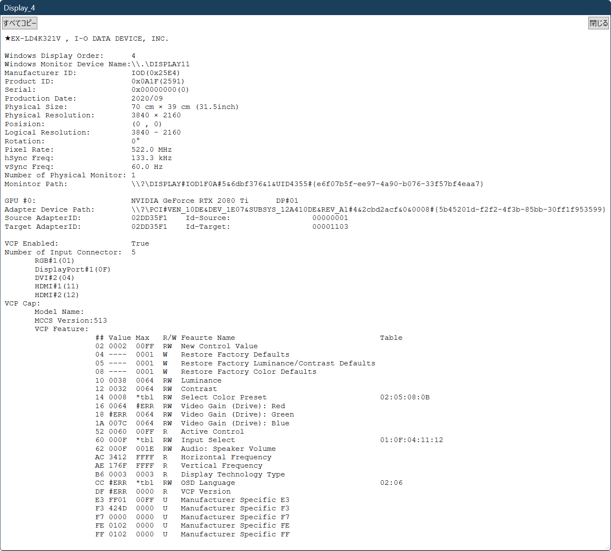
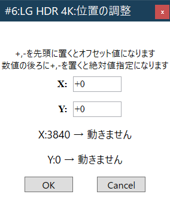
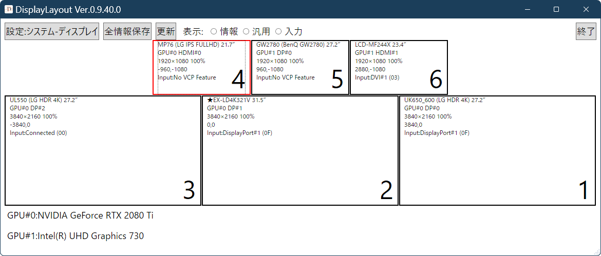
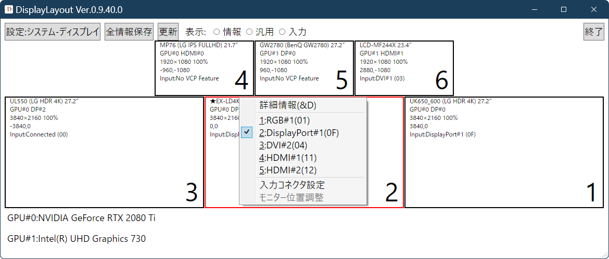

マルチディスプレイユーティリティ/Multi-Display Utility

# DisplayLayout

    

### 特徴

Windows10/11のディスプレイ情報を「設定」と同じレイアウトで表示し、さらに詳細な情報も表示可能です。また、モニターのデスクトップ内での表示位置を微調整できます。これでモニター同士を正確に位置合わせすることが可能です。
 
Ver.0.9.25.0から、VCPコマンドのうち、読出しが可能なものは、現在値を表示するようになりました。あわせて、設定値の最大値やテーブル値を表示します。

New! Ver.0.9.31.0から、ホットキー（Win+Alt+O）によるアクティブ化。および数字キーによるモニタの選択。コンテキストメニューの入力コネクタ選択にキーボードアクセラレーターが対応しました。これにより、モニターの入力端子切り替えをすべてキーボードから操作できるようになりました。

### Windowsのディスプレイと同じ番号を表示できます

* 「設定　⇒　システム　⇒　ディスプレイ」と同じレイアウトで表示できる
*  さらに、モニター名称などを表示します。

    
<B>DisplayLayoutウィンドウ</B>

    

* DisplayLayoutのマルチモニター表示は、Windowsの設定ページと同じで、ディプレイに割り当てられる番号も同一です。

  

    
<B>Windows マルチディスプレイ設定</B>

    

Windows 設定 ⇒ システム ⇒ ディスプレイ ⇒ マルチディスプレイ、の表示

### モニターの情報を表示します

* モニター名、接続しているGPU、コネクタ、物理解像度、表示倍率、デスクトップ内の位置、入力コネクタ（モニター側コネクタ）などの情報を表示できます。

    
<B>モニター情報</B>

    

各モニタの情報。上から「モニタ機種名」、「接続GPUとコネクタ」、「物理解像度」、と「表示倍率」、デスクトップ内の「位置」、「入力コネクタ」。右下がWindowsの「モニタ番号」になります。

* コネクタの表示は、モニターのスペックに依存します。VCP機能で接続中のコネクタを取得できないモニターでは、表示が行えない場合があります。

### 稼働中のGPUの表示

システムに存在する、ドライバがロードされていて、モニターが接続されている「稼働中」のGPUを表示します。先頭にあるものが、起動時にBIOS表示が有効になるプライマリGPUボードになります。

### メインウィンドウ上部のボタン
* 「設定:システム-ディスプレイ」は、「設定アプリ ⇒ ディスプレイ」を開きます
* 「設定保存」は、ユーザーのドキュメントフォルダにすべてのモニターの詳細情報をテキストで保* 存します。少し時間がかかるので、マウスカーソルが通常状態になるまでお待ちください。動作中はマウスカーソルが砂時計などに変わり、ボタンが動作禁止状態（グレーアウト）になっています。
* 「更新」ボタンは、表示を更新します。モニター構成を変更したあと、自動で更新されない場合などに利用してください
* 「表示」はいまのところ開発中で動作しません
* 「終了」は、このプログラムを終了します

### 右クリックでメニューを表示します

* メインウィンドウ内のモニターの上で右クリックするとコンテキストメニュー（右クリックメニュー）が開きます
* 「詳細情報」、「入力コネクタ切り替え」（入力コネクタ名のリストが表示されます）、「モニター位置調整」と「入力コネクタ設定」の４つの機能があります
*  入力コネクタ切り替えは、数字キーがアクセラレーターに設定されており、コネクタ名の左側に表示されている数字キーを押すことでモニターの入力端子を切り替えます

    
<B>コンテキストメニュー</B>

    

### 詳細情報

* 「詳細情報」では、モニターに関してWindowsから調査可能な情報を表示します。モニター自体に関する情報はモニター自身に問い合わせを行って入手しています。公式なスペックなどと必ずしも一致するとは限りません。
* Ver.0.9.15.0からは、入力コネクタ数やコネクタのリストを表示できます（ただし情報取得が可能モニターに限られます）。
* VCP情報を整理して表示するようになりました（Ver.0.9.14.0から）。
* VCPコマンドのうち、読出しが可能なものは、現在の値などを表示することができるようになりました（Ver.0.9.25.0から）。 

    
<B>詳細情報</B>

    

詳細情報は、モニターが出力した情報に基づいています。一部のモニターは、カタログスペックとは異なる情報を出力するものがあります。

### モニター位置調整
モニター位置調整は、各モニターのデスクトップ内での位置をドット単位で指定するものです。Windowsの設定と異なり、数値指定であるため、正確に位置合わせを行うことができます。

ただし、Windowsの設定とは異なり、モニターの位置を指定したとき、他のモニターと重なってしまう場合には位置調整が行えません。他のモニターの位置を自動でずらす機能はないため、先に重なってしまうモニターの位置をずらす必要があります。

また、Windowsでは、原則プライマリモニターの位置を動かすことはできません。

    
<B>詳細情報</B>

    

座標の絶対値、または現在位置からの相対位置で位置を指定します。Windowsでは、モニターの左上の座標位置でデスクトップ内のモニターの表示位置を表現します。プライマリーモニターは、かならず原点（0,0）になります。
モニターを移動させるとき、絶対座標でモニター座標を指定する場合には、座標値が正数の場合には数値のみ（後ろに+をつけても可）、負数の場合には数値の後ろに-をつけてください。

**例**

		X: 1980-           ⇒ X座標を-1980に設定
		X: 3840            ⇒ X座標を3840に設定

現在位置からの相対座標を指定する場合には、数値の前に+または-をつけてください。

**例**

		X: -10            ⇒ X座標を10ドット左に動かす
		X: +20            ⇒ X座標を20ドット右に動かす

※**Windows側APIの都合により、移動可能なのに移動できないことがあります。**

* ChangeDisplaySettingsEx関数がSuccessfullを返しているにもかかわらず、モニターが移動しません。特に隣接モニターと空きなしに接している場合、数ドット程度の移動が無効になることがあります。大きく動かしたい場合には、ウィンドウ右上の「設定:システム-ディスプレイ」を使って、Windows側の機能で動かすことをお勧めします。DisplayLayoutのモニター位置調整は、マウス操作で生じた数ドット程度の空きをなくすことを目的にしています。

※**入力数値には一切制限をかけていません。**

 - 実行前に値の確認を十分に行い、ご自身のリスクで実行してください。 
  
#### Windowsのモニター構成の変更に追従します

Windowsがモニター構成を認識するには少し時間がかかることがあります。このため追従には少し時間がかかります。ウィンドウ上部の「更新」ボタンで強制的に変更することができます。ディスプレイの複製（Windowsの設定から行います）を行っても正しく表示できます。

    
<B>DisplayLayoutウィンドウ</B>

    
    
ディスプレイの複製機能は、他のモニターと同じ場所を表示させるものです。プライマリーモニター以外は設定が可能です

### 入力コネクタ設定
モニターがVCPに正しく対応している場合、コンテキストメニューからモニターの入力コネクタを切り替えることができます。モニターの仕様に起因するいくつかの制限があります。

モニターは、物理的に装備されいるコネクタの種類や数を正しく報告するとは限りません。たとえば、下位機種で入力コネクタを省略しても、モニター内のコントロール基板が上位機種と同じものならば、内部のコントローラーが認識している入力コネクタを報告します。VESAの仕様では、すべての種類の入力コネクタは２つまでとされおり、同一種（たとえば、HDMIなど）の入力コネクタを3つ以上装備しているモニターでは、内部的なコネクタ種別を報告します。

ただし、モニターがVCPに対応していても、接続中の入力コネクタとして“0”しか返さない機種があります。この場合、DisplayLayoutは、接続中かどうかを判定できず、また、現在の入力コネクタを判別できません。その場合、モニターの情報に「Input:Connected(00)」と表示されます。このとき、メニューから切り替えの指示は可能ですが、結果を正しく反映できません。また、別の入力コネクタが有効になると、VCPに応答を返さなくなるモニターがあり、その場合には、モニターが消失した状態になります。

コンテキストメニューの入力コネクタ切り替えには1から始まるキーボードアクセラレーターが定義されており、コンテキストメニュー左側の数字キーを押すことで入力端子を切り替えることができます。

New! Ver.0.9.40から、数字キー（テンキーを含む）で、モニターの選択、入力コネクタの選択が可能になりました。

モニターの選択は、0、1から最大モニタ番号までの数字キーで行います。現在のところ10台を越えるモニターを選択することはできません。選択されたモニターの枠は赤色になります。

    
<B>モニター選択状態のDisplayLayoutウィンドウ</B>

    
    
選択されたモニターは赤枠で表示されます

この状態で、メニューキー（Appキー）で右クリックメニューを表示させることも可能です。また、モニターが選択された状態で数字キーを押すと対応した入力コネクタに切り替わります。数字と入力コネクタの対応は、右クリックメニューと同じで、1から始まる数字を使います。

    
<B>モニター選択状態のDisplayLayoutウィンドウ</B>

    
    
モニターか選択状態（赤枠）のとき、メニューキー（Appキー）で右クリックメニューを表示できます

